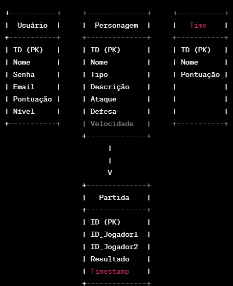

# Amazônia Arena - (back-end)
**Inspirado no jogo Naruto Arena, este projeto visa reproduzir as principais funcionalidades desse renomado jogo.**
---
# Tela principal
## Requisitos Funcionais
- [ ] Deve ser possível se cadastrar;
- [ ] Deve ser possível se autenticar;
- [ ] Deve ser possível deslogar da aplicação;
- [ ] Deve ser possível obter o perfil de um usuário logado;
- [ ] Deve ser possível visualizar todos personagens do jogo;
- [ ] Deve ser possível montar uma equipe de 3 personagens;
- [ ] Deve ser possível visualizar as informações de um personagem;
- [ ] Deve ser possível iniciar uma partida online;

## Regras de Negócio
- [ ] O usuário não deve poder se cadastrar com um e-mail duplicado;
- [ ] O usuário não deve poder escolher personagens que não foram desbloqueados;
- [ ] O usuário não deve poder iniciar uma partida com menos de 3 personagens na equipe;

## Requisitos Não Funcionais
- [ ] A senha do usuário precisa estar criptografada;
- [ ] Os dados da aplicação precisam estar persistidos no banco PostgreSQL em produção;
- [ ] Todas listas de dados precisam estar paginadas com 10 itens por página;
- [ ] O usuário deve ser identificado por um JWT (JSON Web Token);
- [ ] A partida deve ser no protocolo WebSocket;

# Modelagem do Banco de Dados

